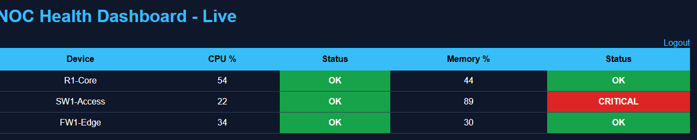

# Python-NOC-Journey
30 Day Python for NOC Engineer
Learning Python for Network Operations and Automation from Chennai 🇮🇳

## 📈 Progress: 15/30 Days Complete

- [x] **Day 1:** Variables, input(), print()
- [x] **Day 2:** String methods - split(), strip(), replace()
- [x] **Day 3:** Loops - for/while + break/continue
- [x] **Day 4:** Lists and Dictionaries - NOC inventory basics
- [x] **Day 5:** File Handling - Log Analyzer
- [x] **Day 6:** Netmiko - SSH to Cisco devices
- [x] **Day 7:** TextFSM - Parse `show` command output
- [x] **Day 8:** CSV Alerting - Alert for DOWN interfaces
- [x] **Day 9:** Config Backup - Netmiko + TextFSM + Mock Fallback
- [x] **Day 10:** Logging - 24x7 monitoring + audit trail
- [x] **Day 11:** CSV Reporting - Uptime extraction + daily reports + Email alerts
- [x] **Day 12:** Multi-threading - Monitor 12 devices parallel - 10x speed boost
- [x] **Day 13:** SNMP Basics - CPU/Memory Monitoring
- [x] **Day 14:** Flask Dashboard - Live Web UI with charts
- [x] **Day 15:** Email Alerts - SMTP + CSV attachments + HTML reports
- [x] **Day 16:** Task Scheduler - Automated daily email alerts at 9 AM**
...
- [ ] **Day 30:** Capstone - Full NOC Automation Suite

## 🔥 Key Projects

### **Day 5: Log Analyzer**
Built log analyzer that parses router logs and counts ERROR/WARNING lines.
**Tech:** Python, file I/O, loops, conditionals

### **Day 9: Config Backup Tool**
Automated config backup for Cisco devices using Netmiko. Added TextFSM parsing + mock fallback for when devices are unreachable.
**Tech:** Netmiko, TextFSM, Exception Handling, Production Patterns

### **Day 10: 24x7 Uptime Monitor**
Implemented production-grade logging for router monitoring. Captures all events with timestamps for audit trail. Graceful fallback when devices fail.
**Tech:** `logging` module, Netmiko, `try/except`, Mock-driven development

### **Day 12: Multi-threaded Monitor**
Cut monitoring time 10x using Python threading. 12 devices in 2.18s vs 24s single-thread.
**Tech:** `threading`, `logging`, Mock network calls, MTTR reduction

### ** Day 13: SNMP Monitor
Built multi-threaded SNMP poller for CPU/Memory. 4 devices in parallel with CRITICAL/WARNING thresholds. Tech: pysnmp, threading, CSV reports

### ** Day 14: NOC Health Dashboard**

Real-time web dashboard for monitoring network devices using SNMP data.

**Features:**
- **Secure Login**: Session-based authentication
- **Live Table**: CPU/Memory with color-coded OK/WARNING/CRITICAL status
- **Bar Chart**: Current CPU & Memory usage for all devices
- **Line Chart**: CPU Trend over last 10 polling cycles
- **Auto Refresh**: Updates every 10 seconds
- **Data Source**: Reads from `snmp_history.csv`

**Tech Stack:** `Python` `Flask` `Jinja2` `Chart.js` `pysnmp` `CSV`

**Screenshot:**


**How to Run:**
```bash
cd Day14_Dashboard
pip install flask pysnmp
python app.pyThen open http://127.0.0.1:5000
Login:admin/password123
## 🚀 Run Projects

### **Day 5: Log Checker**
```bash
python Day05_File_Handling/day5_log_checker.py

### **Day 13: SNMP check**
python Day13_SNMP/snmp_check.py

### Day 14: Launch Dashboard
python Day14_Dashboard/app.py
then open http://127.0.0.1:5000